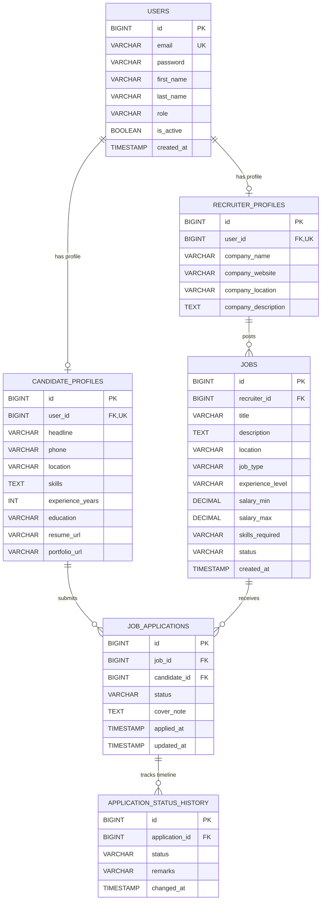

# TalentBridge — Job Recruitment Platform

[](https://www.oracle.com/java/)
[](https://spring.io/projects/spring-boot)
[](https://react.dev/)
[](https://www.mysql.com/)
[](LICENSE)

A modern, full-stack recruitment web application built to connect tech job seekers, hiring managers, and platform administrators. Built with an authentic entry-level architecture that emphasizes clean code separation, relational integrity, role-based access control (RBAC), and automated testing.

---

## Table of Contents
1. [Project Overview](#project-overview)
2. [Key Capabilities by Role](#key-capabilities-by-role)
3. [Technology Stack](#technology-stack)
4. [Architecture & Design](#architecture--design)
5. [Database Schema & ER Diagram](#database-schema--er-diagram)
6. [REST API Documentation](#rest-api-documentation)
7. [Local Setup Instructions](#local-setup-instructions)
8. [Docker Compose Deployment](#docker-compose-deployment)
9. [Pre-configured Demo Credentials](#pre-configured-demo-credentials)
10. [Automated Testing](#automated-testing)
11. [Roadmap & Future Enhancements](#roadmap--future-enhancements)

---

## 1. Project Overview

TalentBridge simplifies tech hiring by providing a transparent, structured recruitment funnel. Instead of black-box application tracking, candidates see live stage-by-stage progression with recruiter feedback, while recruiters can manage listings and candidate pipelines efficiently.

### Core Objectives:
* **Clean Layered Backend**: Strict separation across Controller, Service, Repository, Entity, and DTO layers.
* **Stateless Security**: JWT-based authentication using modern JJWT `0.12.6` with token verification via a servlet filter.
* **Reliable Data Model**: Foreign key constraints, unique indexing to prevent duplicate submissions, and automated audit tracking.
* **Maintainable Frontend**: Built with React 18 and pure CSS variables (no bloated third-party CSS frameworks like Tailwind or Bootstrap).
* **Test Coverage**: 26 automated unit and MockMvc integration tests verifying business logic, authorization boundaries, and database operations.

---

## 2. Key Capabilities by Role

### 👨‍💻 Job Seekers (Candidates)
* **Registration & Login**: Secure registration with BCrypt-hashed credentials.
* **Developer Profile**: Maintain headline, phone, location, technical skills list, education, experience years, resume link, and portfolio link.
* **Job Discovery**: Multi-criteria search filtering by keyword, location, job type (`FULL_TIME`, `PART_TIME`, `CONTRACT`, `INTERNSHIP`), and experience level.
* **One-Click Application**: Apply with an optional cover note; candidate credentials and resume links are automatically attached.
* **Status Progression Stepper**: Track live application status (`APPLIED` ➔ `SHORTLISTED` ➔ `INTERVIEW_SCHEDULED` ➔ `SELECTED` / `REJECTED`) with recruiter remarks.
* **Self-Service Withdrawal**: Gracefully withdraw active applications prior to decision.

### 🏢 Hiring Managers (Recruiters)
* **Company Profile**: Setup company branding, location, website, and mission statement.
* **Job Management**: Create, edit, close, and delete job postings with salary ranges and technical criteria.
* **Applicant Screening**: View candidates per opening or platform-wide, filtered by stage.
* **Dossier Review**: Inspect applicant profiles, portfolio links, and pitches.
* **Pipeline Management**: Transition candidate status with personalized feedback notes recorded to the audit timeline.
* **Recruitment Dashboard**: Real-time stats on active listings, total applicants, scheduled interviews, and hires.

### 🛡️ Platform Administrators
* **Ecosystem Telemetry**: Platform-wide KPIs including total user accounts, recruiter/candidate distributions, active listings, and application counts.
* **Account Governance**: Search user accounts and suspend/reactivate access with confirmation modals.
* **Job Moderation**: Audit all published listings and close or delete non-compliant postings.

---

## 3. Technology Stack

### Backend
* **Language**: Java 17 / 21
* **Framework**: Spring Boot 3.3.4 (Spring MVC, Spring Data JPA, Spring Security)
* **ORM & Database**: Hibernate 6 / MySQL 8.0 (with in-memory H2 profile for test execution)
* **Security & Auth**: JJWT `0.12.6` (HMAC-SHA256 signature verification)
* **Documentation**: SpringDoc OpenAPI 3 / Swagger UI (`springdoc-openapi-starter-webmvc-ui` 2.6.0)
* **Build Tool**: Apache Maven 3.9+

### Frontend
* **Library**: React 18
* **Build Tool**: Vite 5
* **Routing**: React Router v6 (Nested layouts, protected routes, dynamic parameters)
* **HTTP Client**: Axios with request/response interceptors for Bearer token injection
* **Styling**: Pure CSS3 with custom CSS design tokens (`--primary`, `--surface`, `--navy-900`), responsive grid, and flexbox (Zero utility framework dependencies)

### Testing & DevOps
* **Testing**: JUnit 5, Mockito, Spring Boot Test, Spring Security Test, MockMvc
* **Containerization**: Docker (multi-stage builds) & Docker Compose

---

## 4. Architecture & Design

### Layered Architecture Flow
```
[React SPA] 
     │  (HTTP / JSON with JWT Bearer Header)
     ▼
[JwtAuthenticationFilter] ➔ Validates token signature & loads UserPrincipal into SecurityContext
     │
     ▼
[Spring Controllers] ➔ Request validation (@Valid), DTO extraction, HTTP status codes
     │
     ▼
[Service Layer] ➔ Business transactions (@Transactional), authorization checks, entity mappings
     │
     ▼
[Data Access / Repositories] ➔ Spring Data JPA interfaces & JPQL multi-criteria filtering
     │
     ▼
[MySQL Database] ➔ Relational storage with foreign key constraints & unique indexes
```

---

## 5. Database Schema & ER Diagram



---

## 6. REST API Documentation

Interactive Swagger documentation is available at `http://localhost:8080/swagger-ui.html`.

### Core Endpoint Summary

| Category | Method | Endpoint | Required Role | Description |
|---|---|---|---|---|
| **Auth** | `POST` | `/api/auth/register` | Public | Register new Candidate or Recruiter |
| **Auth** | `POST` | `/api/auth/login` | Public | Authenticate and obtain JWT token |
| **Auth** | `GET` | `/api/auth/me` | Authenticated | Retrieve current user profile |
| **Jobs** | `GET` | `/api/jobs` | Public | Paginated search with filters |
| **Jobs** | `GET` | `/api/jobs/{id}` | Public | Get complete job details |
| **Candidate** | `GET` | `/api/candidate/profile` | `ROLE_CANDIDATE` | Fetch candidate profile |
| **Candidate** | `PUT` | `/api/candidate/profile` | `ROLE_CANDIDATE` | Update candidate skills & links |
| **Candidate** | `POST` | `/api/candidate/applications` | `ROLE_CANDIDATE` | Apply for job with cover note |
| **Candidate** | `GET` | `/api/candidate/applications` | `ROLE_CANDIDATE` | List candidate's applications |
| **Candidate** | `GET` | `/api/candidate/applications/{id}` | `ROLE_CANDIDATE` | View application & timeline history |
| **Candidate** | `PUT` | `/api/candidate/applications/{id}/withdraw` | `ROLE_CANDIDATE` | Withdraw active application |
| **Candidate** | `GET` | `/api/candidate/dashboard` | `ROLE_CANDIDATE` | Candidate application funnel stats |
| **Recruiter** | `POST` | `/api/recruiter/jobs` | `ROLE_RECRUITER` | Create new job posting |
| **Recruiter** | `GET` | `/api/recruiter/jobs` | `ROLE_RECRUITER` | List recruiter's postings |
| **Recruiter** | `PUT` | `/api/recruiter/jobs/{id}` | `ROLE_RECRUITER` | Edit job posting or status |
| **Recruiter** | `DELETE` | `/api/recruiter/jobs/{id}` | `ROLE_RECRUITER` | Delete job posting |
| **Recruiter** | `GET` | `/api/recruiter/jobs/{id}/applications` | `ROLE_RECRUITER` | List applicants for specific job |
| **Recruiter** | `PUT` | `/api/recruiter/applications/{id}/status` | `ROLE_RECRUITER` | Update candidate status & add remarks |
| **Recruiter** | `GET` | `/api/recruiter/dashboard` | `ROLE_RECRUITER` | Recruiter dashboard metrics |
| **Admin** | `GET` | `/api/admin/stats` | `ROLE_ADMIN` | Platform analytics and telemetry |
| **Admin** | `GET` | `/api/admin/users` | `ROLE_ADMIN` | Filter and search all accounts |
| **Admin** | `PUT` | `/api/admin/users/{id}/status` | `ROLE_ADMIN` | Suspend or reactivate user |
| **Admin** | `GET` | `/api/admin/jobs` | `ROLE_ADMIN` | View all platform job listings |
| **Admin** | `PUT` | `/api/admin/jobs/{id}/status` | `ROLE_ADMIN` | Override job status |
| **Admin** | `DELETE` | `/api/admin/jobs/{id}` | `ROLE_ADMIN` | Remove non-compliant job listing |

---

## 7. Local Setup Instructions

### Prerequisites
* **Java 17** or higher
* **Node.js 18+** & **npm 9+**
* **MySQL 8.0**
* **Maven 3.9+**

### Step 1: Database Setup
Log into MySQL and initialize the schema:
```sql
CREATE DATABASE IF NOT EXISTS talentbridge_db;
```

### Step 2: Configure & Run Backend
Navigate to `backend/src/main/resources/application.properties` and verify your MySQL credentials:
```properties
spring.datasource.url=jdbc:mysql://localhost:3306/talentbridge_db?createDatabaseIfNotExist=true&useSSL=false&allowPublicKeyRetrieval=true&serverTimezone=UTC
spring.datasource.username=root
spring.datasource.password=your_mysql_password
```

Start the backend:
```bash
cd backend
mvn spring-boot:run
```
Backend will start on `http://localhost:8080`. Sample accounts and jobs will be seeded automatically on startup.

### Step 3: Run Frontend
Open a new terminal:
```bash
cd frontend
npm install
npm run dev
```
Access the application at `http://localhost:5173`.

---

## 8. Docker Compose Deployment

To build and run all 3 services (MySQL 8, Spring Boot Backend, and Nginx React Frontend) in isolated Docker containers:

```bash
docker-compose up --build
```

* **Frontend UI**: `http://localhost:3000`
* **Backend API**: `http://localhost:8080`
* **Swagger Documentation**: `http://localhost:8080/swagger-ui.html`

To stop containers and preserve data:
```bash
docker-compose down
```

---

## 9. Pre-configured Demo Credentials

The platform seeds test users automatically via `DataInitializer`:

| Role | Email | Password | Description |
|---|---|---|---|
| **Administrator** | `admin@talentbridge.com` | `Admin@123` | Platform oversight & moderation |
| **Recruiter** | `recruiter@techcorp.com` | `Recruiter@123` | TechCorp hiring manager with active postings |
| **Candidate** | `candidate@gmail.com` | `Candidate@123` | Junior Java Developer candidate with sample applications |

> **Tip**: The login page includes 1-click **Demo Account** buttons to instantly fill credentials during reviews.

---

## 10. Automated Testing

The backend includes 26 unit and MockMvc integration tests verifying security authorization boundaries, duplicate detection, and repository queries:

```bash
cd backend
mvn clean test
```

### Verified Test Suites:
* `AuthControllerTest`: Registration, login validation, JWT generation.
* `JobControllerTest`: Public search filtering, recruiter job creation, unauthorized access rejection.
* `CandidateControllerTest`: Profile updates, job applications, duplicate prevention.
* `RecruiterApplicationControllerTest`: Pipeline queries, status updates, remark persistence.
* `AdminControllerTest`: Platform KPI aggregation, account status toggles.
* `UserRepositoryTest`: Database constraint enforcement and custom query performance.

---

## 11. Roadmap & Future Enhancements

* **OAuth2 Social Sign-In**: Integration with Google / GitHub authentication.
* **Cloud Storage**: Resume uploads to Amazon S3 or MinIO with pre-signed download URLs instead of hosted links.
* **Email Notifications**: Asynchronous email delivery via Spring Mail (`JavaMailSender`) upon application submission or status changes.
* **WebSockets**: Real-time notification badge updates for status changes.

---

## License
This project is open-source and available under the [MIT License](LICENSE).
